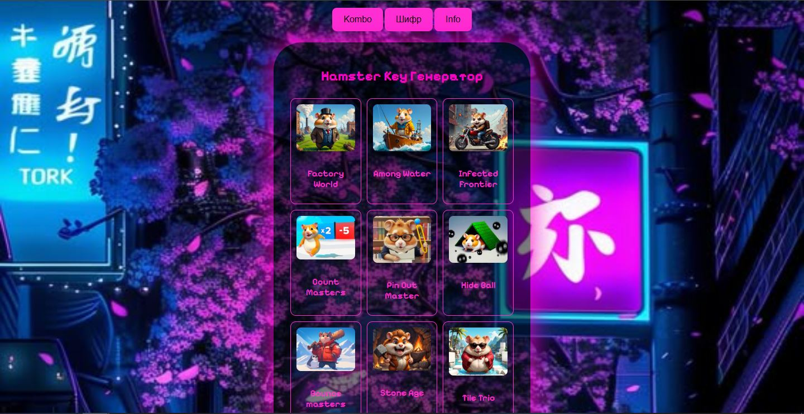
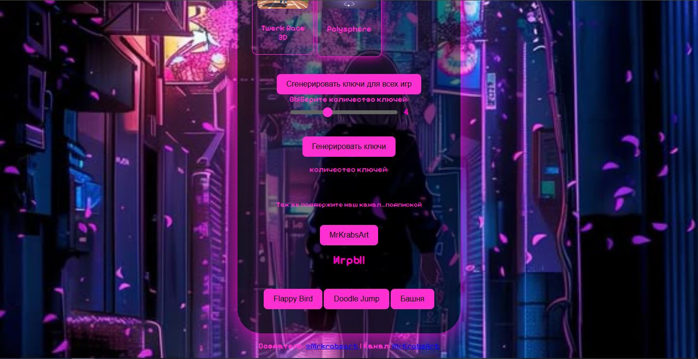

# 🐹 Hamster Key Генератор

[](https://astounding-bavarois-09109e.netlify.app/)
[](https://opensource.org/licenses/MIT)

Генератор промо-ключей для игр Hamster Kombat и связанных проектов. Поддерживает 17+ игр с автоматической эмуляцией прогресса и генерацией ключей.




## ✨ Возможности

- 🎮 Поддержка 17+ игр Hamster Kombat
- 🔑 Генерация ключей для одной или всех игр одновременно
- 🎰 Настройка количества ключей (1-10 за раз)
- 📋 Автоматическое копирование ключей
- ⏳ Прогресс бар с визуализацией процесса
- 🔄 Возможность повторной генерации
- 🕹️ 3 Игры для комфортного ожидания генерации ключей (Doodl, Flappy Bird, Башня) 

## 🕹️ Поддерживаемые игры

1. Factory World
2. Among Water
3. Infected Frontier
4. Count Masters
5. Pin Out Master
6. Hide Ball
7. Bouncemasters
8. Stone Age
9. Tile Trio
10. Fluff Crusade
11. Mow and Trim
12. Train Miner
13. Chain Cube 2048
14. Merge Away
15. Zoopolis
16. Twerk Race 3D
17. Polysphere

## 🚀 Как использовать

1. Выберите игру из списка доступных
2. Укажите количество ключей (ползунком 1-10)
3. Нажмите "Генерировать ключи"
4. Дождитесь завершения процесса (прогресс бар покажет статус)
5. Скопируйте ключи кнопкой/кнопками
6. Для генерации всех ключей сразу используйте специальную кнопку

> ⚠️ При превышении лимитов запросов используйте VPN или подождите 10 минут

## 👨💻 Разработка

### Технологии
- HTML5/CSS3
- Vanilla JavaScript
- Toastr для уведомлений
- Netlify для хостинга

### Установка
```
git https://github.com/Tomreet/MrKrabsArt-Gen
cd MrKrabsArt-Gen
```
# Открыть index.html в браузере
## 📜 Лицензия
Распространяется под лицензией [MIT](LICENSE). 

## 🔗 Ссылки
- [Демо-версия](https://astendant-bavarois-09109e.netlify.app/)
- Автор: [MrKrabsArt]() - t.me/Mrkrabsart 👨💻
- Поддержка: [Почта]() - kajkovartem20@gmail.com ✉️
- Телеграмм канал: [ссылка]() - (t.me/lMrKrabsArtl) 💻
- Вклад: Пиар и предложения приветствуются! 🤝
